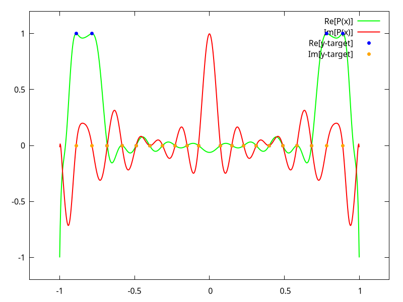

# The goal

push larger and larger polys. Current largest fit: rand,100 with hotstart,80,400 in ~800s

runs in <1s for poly degree of 60 using hotstart

### Usage

```
Fit a QSP polynomial to the given sequence of target points.

Usage: ex3-rs [OPTIONS] <COMMAND>

Commands:
  solve-poly
  plot-runtimes
  help           Print this message or the help of the given subcommand(s)

Options:
  -m, --backend-mode <BACKEND_MODE>  Enable/disable multithreading for gradient, lossfunction evaluation. Auto: will do single threading for small d & short sequences. (both <= 100) [default: auto] [possible values: single-thread, multi-thread, auto]
  -M, --mode <MODE>                  Solve mode: "simple,D" — direct solve at degree D "hotstart,S,D" — solve at degree S, then continue at degree D "cascade,N,D" — N cascading steps up to degree D if running PlotRuntimes task, this will be interpreted as a ratio and scaled accordingly [default: hotstart,20,60]
  -s, --solver <KIND>                Which optimizer to use [default: bfgs] [possible values: bfgs, lm]
  -h, --help                         Print help (see more with '--help')

L-BFGS Options:
      --bfgs-max-iters <bfgs_max_iters>  [default: 500000]
      --bfgs-mem <bfgs_mem>              [default: 10]
      --bfgs-tol-grad <bfgs_tol_grad>    [default: 1e-8]

Levenberg-Marquardt Options:
      --lm-max-iters <lm_max_iters>            [default: 500]
      --lm-initial-lambda <lm_initial_lambda>  [default: 1e-4]
      --lm-tol <lm_tol>                        [default: 1e-10]
```

### Example output

```
ex3-rs -M "simple,60" solve-poly "rand,10" -D ./data/r10.dat
[i] Running with mode=Simple(60) and multithreading=Auto. Target:
x:
[
    0: -0.073
    1: -0.149
    2: -0.229
    3: -0.312
    4: -0.399
    5: -0.49
    6: -0.584
    7: -0.682
    8: -0.784
    9: -0.89
   10:  0.89
   11:  0.784
   12:  0.682
   13:  0.584
   14:  0.49
   15:  0.399
   16:  0.312
   17:  0.229
   18:  0.149
   19:  0.073
]
y:
[
    0: 0
    1: 0
    2: 0
    3: 0
    4: 0
    5: 0
    6: 0
    7: 0
    8: 1
    9: 1
   10: 1
   11: 1
   12: 0
   13: 0
   14: 0
   15: 0
   16: 0
   17: 0
   18: 0
   19: 0
]
[+] Finished solving! Elapsed: 76.029613ms. Final loss: 8.976629366105347e-14. Resulting phases:
[
    0:  2.66109
    1:  6.65703
    2:  13.81531
    3:  0.48863
    4:  11.77209
    5: -0.35963
    6:  5.38861
    7: -0.13944
    8:  12.10343
    9:  5.09723
   10:  7.07265
   11:  0.09674
   12:  4.87031
   13:  4.39615
   14:  4.46475
   15:  7.14745
   16: -5.33067
   17: -2.31998
   18: -2.43096
   19: -3.95494
   20: -4.65209
   21:  6.58394
   22:  1.31224
   23: -2.57403
   24:  2.28203
   25:  1.01419
   26: -0.65385
   27: -1.8308
   28: -0.03642
   29:  6.35779
   30:  0.06499
   31:  7.71354
   32:  9.66899
   33:  8.02127
   34:  5.82916
   35: -1.5366
   36:  9.64129
   37: -2.95533
   38:  5.75118
   39:  11.14523
   40:  5.59889
   41:  10.43575
   42:  4.27038
   43:  5.66292
   44:  4.86689
   45:  6.34395
   46:  3.54874
   47: -3.08904
   48:  6.26276
   49: -6.14657
   50:  1.70683
   51:  3.20827
   52: -3.17855
   53:  1.44499
   54: -0.01109
   55:  6.22413
   56:  2.31672
   57: -5.0544
   58:  0.83868
   59: -10.00539
   60:  1.78879
]
Wrote drawing data to './data/r10.dat'
```

### Plotting

using the example above, from the project root:

```
gnuplot -e "infile='./data/r10.dat'; outfile='./plotting/r10.png'" ./plotting/plot_x.gp
```

gives

